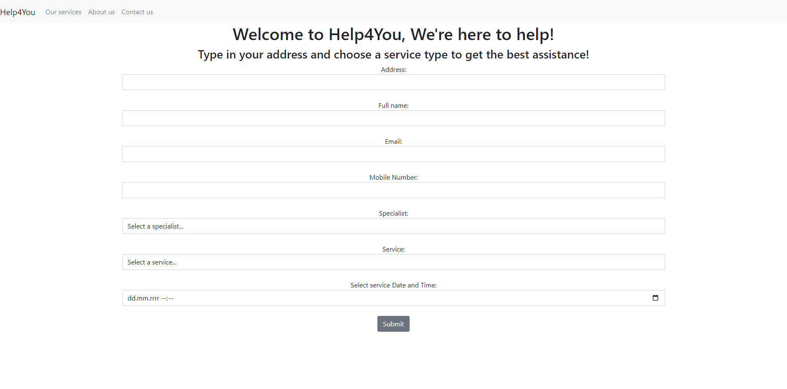

# Help4YouAPP
Household services ordering system.

## Table of Contents
* [General Info](#general-information)
* [Technologies Used](#technologies-used)
* [Features](#features)
* [Screenshots](#screenshots)
* [Project Status](#project-status)
* [Contact](#contact)

## General Information
This app allows users to order available houshold services, f.e. draining pipes. Workers are responsible for different types of services,
so there's no possibilty where plumber can be ordered to paint client's walls. The app also checks the worker's availability.
It means that user will be notified that worker is not available on selected date. The app saves submitted form even if the visit
wasn't confirmed. It could be useful in case we wanted to call back the user and persuade him into ordering the service anyway.
However, if the orded is confirmed all the visit details are also sent to user and to the specific worker via email. 

## Technologies Used
- Python - version 3.11
- Django - version 4.2.1
- psycopg2-binary - version 2.9.6

## Screenshots

## Features
- Order household services
- Send visit's details via email to the client and the worker
- Display available services in services template
- Store all confirmed and not confirmed forms in the database
- Check worker's availabilty for particular date and service

## Project Status
Project is: _complete_ 

## Contact
Created by [@systenconti](https://github.com/systenconti) - feel free to contact me!
